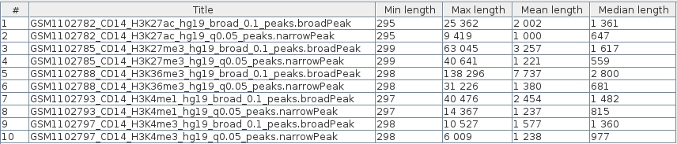

```{r setup, include=FALSE}
knitr::opts_chunk$set(echo = T, message = F, warning = F)
```

## Load libs

```{r}
library(data.table)
library(dplyr)
library(plyr)
```

## Prepare function

```{r}
get_stats <- function(path) {
  df <- fread(path) %>% select(c(V2, V3))
  data.frame(min_len = min(df$V3 - df$V2),
             max_len = max(df$V3 - df$V2),
             mean_len = floor(mean(df$V3 - df$V2)),
             median_len = floor(median(df$V3 - df$V2)))
}
```

## Get input filenames (located in script directory)

```{r}
broad_peaks <-
  list.files(recursive = T, full.names = T)[grepl('broad',
                                                  list.files(recursive = T,
                                                             full.names = T))]
narrow_peaks <-
  list.files(recursive = T, full.names = T)[grepl('narrow',
                                                  list.files(recursive = T,
                                                             full.names = T))]
```

## Broad peaks: get stats

```{r}
knitr::kable(ldply(broad_peaks, get_stats) %>%
               magrittr::set_rownames(gsub('.*/|_peaks.*', '', broad_peaks)))
```

## Narrow peaks: get stats

```{r}
knitr::kable(ldply(narrow_peaks, get_stats) %>%
               magrittr::set_rownames(gsub('.*/|_peaks.*', '', narrow_peaks)))
```

## Validate using JBR statistics ("about track" window)

